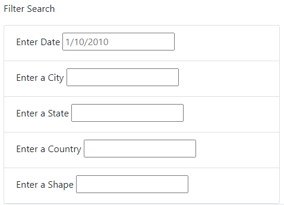
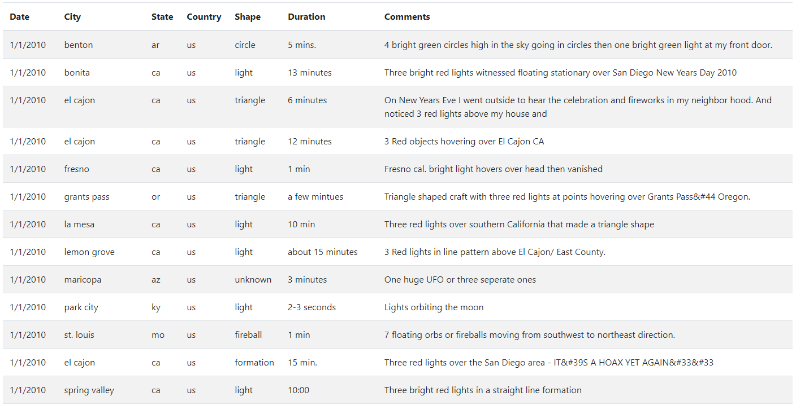
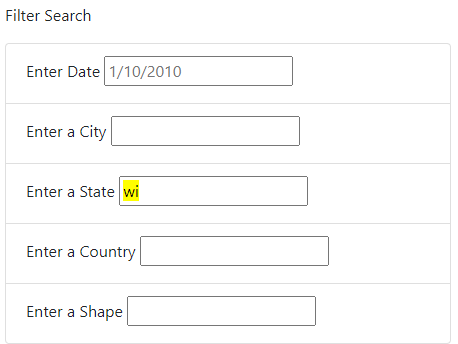
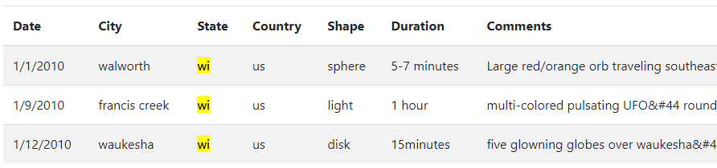

# UFOs

## Overview of Project

### Purpose of this analysis.

The purpose of this analysis is to provide an in-depth analysis of UFO sightings by allowing users to filter a web-based table for multiple criteria at the same time. 

## Results

### Process of using the search criteria.

#### Web elements

Inputs to influence the table filtering are made available for the date, city, state, country and shape fields.

A readout of the table is provided aside the filter block (below on mobile).

#### Interaction

Filter input boxes can be updated with text.

When the inputs are changed, the table is updated to include only rows where the corresponding fields match the criteria defined by the filter inputs.

## Summary

### Drawback of this new design

Filter inputs must be typed to exactly match what appears in the table, requiring users to deeply inspect the table to find values that can be added to the filter.

### Recommendations for further development

1. Categorical filters such as the Shape field may benefit from being updated from a text input to a dropdown selection.

2. Datatypes for the Date and Shape fields could be converted to a sortable datatype, and sorting capabilities could be added to the table.